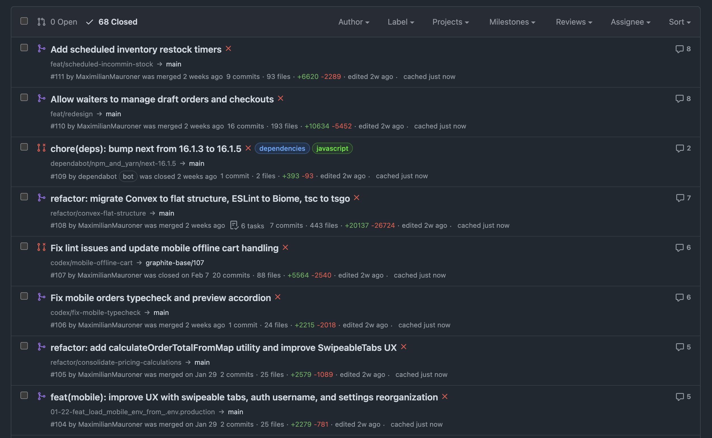
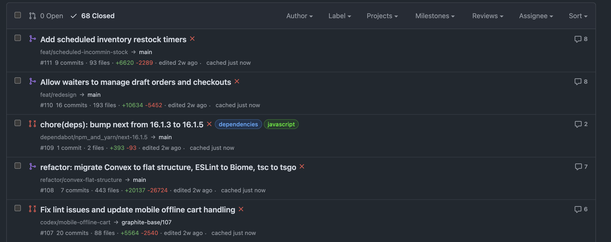

# Better GitHub PR View

A Manifest V3 browser extension that adds a compact metadata strip to GitHub repository pull request list rows.




It is narrowly scoped: on repository `Pull requests` pages, it augments each visible row with information that normally requires opening the PR first.

## What it does

- Enhances repository `Pull requests` pages on `github.com`
- Adds compact inline row metadata that stays close to GitHub's native styling
- Surfaces commit count and files changed directly in the list
- Adds line-change totals and latest activity
- Lets you keep or hide GitHub's native row metadata pieces like PR number, opened time, author, and task progress
- Hydrates visible rows only, with in-memory caching and bounded fetch concurrency
- Caches fetched PR metadata locally and supports manual cache clearing from the popup

## Current scope

This version targets repository-level pull request list pages only:

- `https://github.com/<owner>/<repo>/pulls`

It does not modify issue lists or individual pull request detail pages.

## Metadata shown

The extension can show:

- commit count
- files changed
- added and deleted line totals
- latest activity
- optional cache freshness state

It can also trim GitHub's native metadata line to keep only the pieces you want visible.

## Project structure

```text
assets/
docs/
manifest.json
popup.html
scripts/
src/
  content/
  content.css
  content.ts
  popup.css
  popup.ts
  shared/
tests/
```

## Install locally in Chrome

1. Run `bun install`.
2. Run `bun run build:chrome`.
3. Open your Chromium-based browser extension page.
4. Enable Developer Mode.
5. Choose `Load unpacked`.
6. Select `dist/chrome`.

## Install locally in Firefox

1. Run `bun install`.
2. Run `bun run build:firefox`.
3. Use Firefox 142 or newer.
4. Open `about:debugging#/runtime/this-firefox`.
5. Choose `Load Temporary Add-on`.
6. Select `dist/firefox/manifest.json`.

## Build and package

1. Install dependencies:

   ```bash
   bun install
   ```

2. Create browser-specific builds:

   ```bash
   bun run build:chrome
   bun run build:firefox
   ```

3. Create upload artifacts:

   ```bash
   bun run pack:chrome
   bun run pack:firefox
   ```

Artifacts are written to:

- `artifacts/better-github-pr-view-chrome-0.1.0.zip`
- `artifacts/better-github-pr-view-firefox-0.1.0.zip`

## Release validation

Run the full release check before uploading to either store:

```bash
bun run check:release
```

This command:

- typechecks the extension and Bun scripts
- builds Chrome and Firefox packages
- runs `web-ext lint` on the Firefox build
- verifies store docs and required assets exist
- creates versioned ZIP artifacts

For the broader repository check used in CI, run:

```bash
bun run check
```

This adds ESLint and Vitest on top of the release packaging flow.

## GitHub downloads

Every push and pull request uploads the Chrome and Firefox ZIP files as GitHub Actions artifacts. Tagged releases also attach the same ZIP files to the GitHub Release page.

Release flow:

1. Update `package.json` with the next extension version.
2. Push the branch and confirm `bun run check:release` passes locally.
3. Create and push a matching tag:

   ```bash
   git tag v0.1.0
   git push origin v0.1.0
   ```

4. Download the release assets from:
   - the workflow run artifacts for CI builds
   - the GitHub Release page for tagged versions

The release workflow fails if the pushed tag does not match `package.json`.

## Submission docs

- Homepage: [`docs/index.md`](./docs/index.md)
- Privacy policy: [`docs/privacy-policy.md`](./docs/privacy-policy.md)
- Support: [`docs/support.md`](./docs/support.md)
- Release checklist: [`docs/release-checklist.md`](./docs/release-checklist.md)

These are repository files linked from the README, not hosted GitHub Pages URLs. If you need public URLs for store submission, publish them separately.
